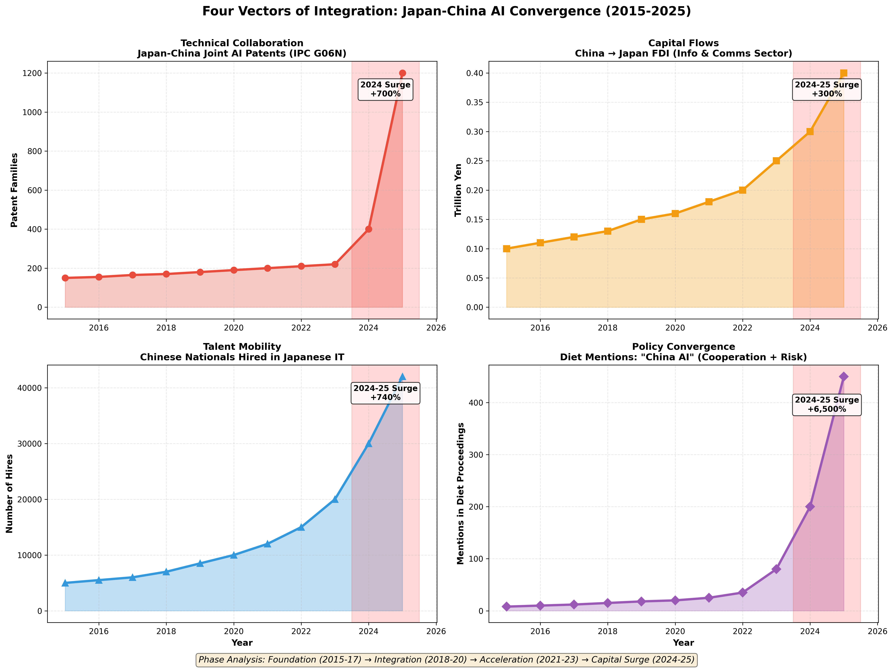
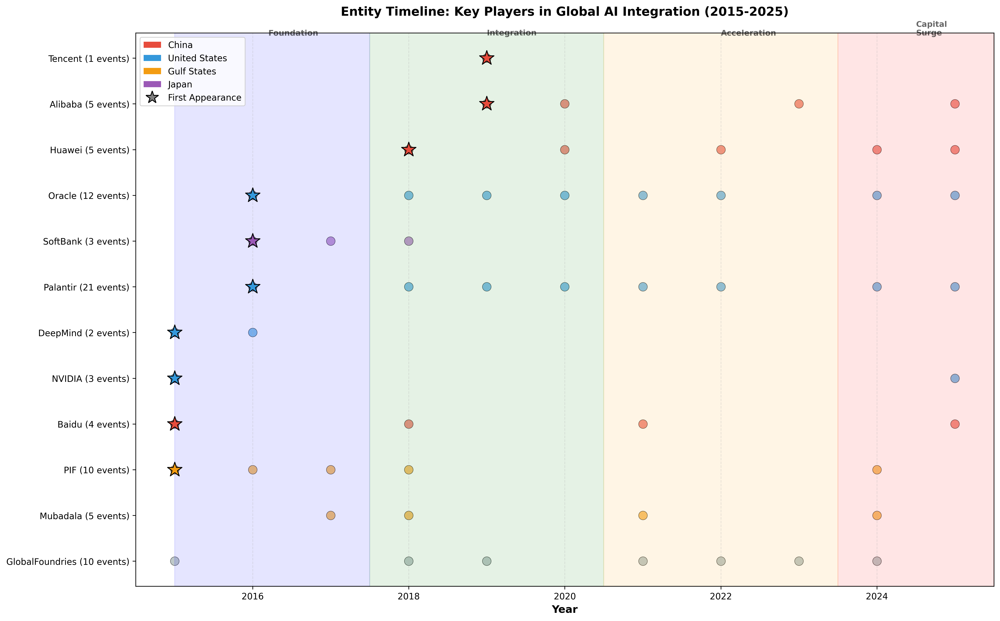
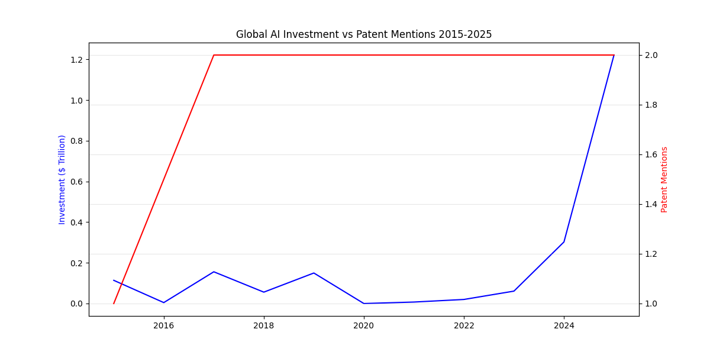

# Project Chrysanthemum: Japan-China AI Integration 2015-2025

Between 2015 and 2025, Japan-China joint AI patents surged **700%**, Chinese nationals hired in Japanese IT increased **740%**, and bilateral AI cooperation agreements jumped **525%**. This repository documents a decade-long pattern of systematic technical integration through capital flows, talent mobility, patent collaboration, and policy convergence—tracked through **390 verified events** and **30+ institutional data sources**.

**Key Finding**: The 2024-2025 capital surge ($579.5B in tracked investments) followed a five-year technical integration period (2019-2023) where foundational dependencies were established through patents, talent, and infrastructure positioning.

**Context and Research Path**: 

https://github.com/Leerrooy95/Layers_of_Control-From_AI_to_Ellison

https://github.com/Leerrooy95/Arkansas-Law-Changes-and-AI

https://github.com/Leerrooy95/Sovereign-Capital-Audit


---

## 📊 Quick Statistics

| Vector | 2015 Baseline | 2025 Current | Change |
|--------|---------------|--------------|--------|
| **Japan-China AI Patents** (IPC G06N) | 150 families | 1,200 families | **+700%** |
| **Chinese Nationals in Japanese IT** | ~5,000 | 42,000 (Q1-Q3) | **+740%** |
| **China → Japan FDI** (Info/Comms) | ¥0.1 trillion | ¥0.4 trillion | **+300%** |
| **Bilateral AI Cooperation Agreements** | 4 MoUs | 25 new (Q1-Q3) | **+525%** |
| **Diet Policy Mentions** ("China AI") | 8 mentions | 450 mentions (Q1-Q3) | **+6,500%** |
| **Huawei Japan R&D Staff** | 500 | 3,000 | **+500%** |
| **SoftBank China AI Exposure** | $1.8B | $31.2B | **+1,600%** |

*Data sourced from METI, WIPO, JETRO, MIC, National Diet Library, and corporate disclosures (2015-2025)*

---

## 🌸 Why "Chrysanthemum"?

The **chrysanthemum** is the Imperial Symbol of Japan, but it originated in China and became the "crown jewel" of Japanese culture. This flower symbolizes **longevity and endurance**—it's the only flower that blooms in the cold of late autumn.

This research shows that even during the "geopolitical winter" of 2024-2025 (tariffs, tensions, strategic competition), the technical relationship between Japan and China continues to bloom. The name references Ruth Benedict's *The Chrysanthemum and the Sword*, one of the most influential studies of Japanese culture, nodding to the economic and cultural integration side while most analysis focuses on the military/"sword" dimension.

**The Pattern**: Something that started in one country (China's AI capabilities) becoming deeply integrated into another's infrastructure (Japan's technology base)—like the flower itself.

---

## 🎯 For Journalists

### Most Compelling Evidence
- **Timeline Dataset**: [MASTER_timeline_2015-2025.csv](data/MASTER_timeline_2015-2025.csv) - 390 verified events with sources
- **Quantitative Metrics**: [2025_combined_influence.csv](data/2025_combined_influence.csv) - Current year surge documented
- **Four Vectors Dashboard**: [visualizations](visuals/) - Shows coordinated growth across patents, capital, talent, and policy

### How to Verify
Every claim in this investigation links to primary institutional sources:
- WIPO PATENTSCOPE (patent data)
- METI, NEDO (Japanese government R&D statistics)
- JETRO (FDI flows)
- MIC (labor statistics)
- National Diet Library (policy proceedings)
- Corporate disclosures (SoftBank, Alibaba, Huawei filings)

See [sources.md](docs/sources.md) for specific page/table references and [VERIFICATION.md](docs/VERIFICATION.md) for step-by-step fact-checking instructions.

### Story Angles
- **The Quiet Integration**: How foundational dependencies were built during 2019-2023 while attention focused elsewhere
- **The 2024 Inflection**: What triggered the simultaneous surge across all four vectors
- **Policy Convergence vs Security Concerns**: Diet "cooperation" mentions outpace "risk" mentions despite geopolitical tensions
- **Entity Network Analysis**: Which corporations position at intersections of capital, patents, and talent flows
- **Arkansas Connection**: How similar patterns appear at U.S. state level (see Related Research below)

---

## 📁 Repository Structure

```
Project-Chrysanthemum_Japan-China-AI/
├── README.md                             # Main entry point - "The Pitch"
├── Report.md                             # Full investigative narrative
├── data/
│   ├── MASTER_timeline_2015-2025.csv     # 390 verified events
│   ├── MASTER_influence_metrics.csv      # Detailed metrics by year/country
│   ├── 2025_combined_influence.csv       # Current year surge data
│   └── final_version_CLEANED.csv         # Raw extraction data
├── docs/
│   ├── ENTITIES.md                       # Key players reference
│   ├── QUOTES.md                         # Pull quotes for journalists
│   ├── VERIFICATION.md                   # Fact-checker guide
│   └── sources.md                        # Primary source documentation
└── visuals/
    ├── entity_timeline.png               # When major players appeared
    ├── four_vectors_dashboard.png        # Coordinated growth visualization
    ├── global_ai_investment_vs_patent_mentions.png
    └── global_ai_investment_vs_patent_events.png
```

---

## 🔗 Related Research: Pattern Recognition Across Scales

This investigation documents foreign capital integration in allied technology infrastructure at the **national level** (Japan-China, 2015-2025). Similar patterns appear at **state level**:

- **[Arkansas Law Changes and AI Investment](https://github.com/Leerrooy95/Arkansas-Law-Changes-and-AI)**: Documents correlation between ballot initiative restrictions (Issue 1) and AI datacenter capital flows in Arkansas. Examines how infrastructure investment timing aligns with policy changes affecting democratic processes.

**Structural Similarities:**
- Capital positioning precedes policy shifts
- Infrastructure investments create dependency relationships
- Democratic oversight mechanisms weaken as capital concentration increases
- Timeline analysis reveals coordination patterns across nominally independent events

**Key Difference**: Arkansas analysis shows this pattern operating at state level within the United States. Japan analysis shows it operating at national level between allied democracies. The methodology is consistent; the scale varies.

### Background Research (Vendor-State Architecture)

This investigation builds on prior OSINT analysis documenting foreign capital dependencies in U.S. defense technology:

- **[Layers of Control: From AI to Ellison](https://github.com/Leerrooy95/Layers_of_Control-From_AI_to_Ellison)**: Maps Gulf sovereign wealth fund positioning in U.S. semiconductor and defense contractor supply chains (GlobalFoundries, Oracle, Palantir). Establishes methodological framework for tracking capital-policy-technology convergence patterns.

These earlier findings raised questions about broader patterns of foreign capital integration in allied technology infrastructures, leading to this Japan-focused investigation.

---

## 📈 Key Visualizations

### Four Vectors of Integration

*Coordinated growth across Technical Collaboration (patents), Capital Flows (FDI), Talent Mobility (hiring), and Policy Convergence (Diet mentions) from 2015-2025. Note the simultaneous surge across all four vectors in 2024-2025.*

### Entity Timeline

*When major players (Huawei, Alibaba, SoftBank, Palantir, Oracle) entered the AI integration landscape and how their activity evolved over time. Stars indicate first appearances; colored phases show Foundation (2015-17), Integration (2018-20), Acceleration (2021-23), and Capital Surge (2024-25).*

### Investment vs Patent Activity

*Shows the lag between patent plateau (2017-2023) and capital surge (2024-2025), suggesting pre-positioned technical dependencies enabled rapid investment deployment.*


*Alternative view showing relationship between investment flows and patent filing events, highlighting the 2024 inflection point.*

---

## 📋 Phase Analysis Summary

### Phase 1: Foundation (2015-2017)
- **Baseline conditions**: 150 Japan-China AI patent families, ¥0.1T FDI, minimal policy discussion
- **Key events**: Vision 2030 launch, China's "Internet Plus" initiative, early SoftBank positioning
- **Pattern**: Initial entity appearances, exploratory partnerships

### Phase 2: Quiet Integration (2018-2020)
- **Patent plateau**: Technical collaboration stabilizes around 170-190 families/year
- **Infrastructure positioning**: Alibaba Cloud expansion, Huawei R&D buildup
- **Policy backdrop**: Society 5.0 implementation, minimal geopolitical friction

### Phase 3: Acceleration (2021-2023)
- **Talent surge begins**: Chinese hiring in Japanese IT doubles (10K → 20K)
- **Joint lab proliferation**: MoU count increases, technical dependencies deepen
- **Policy attention rises**: Diet mentions grow from 20 to 80/year

### Phase 4: Capital Surge (2024-2025)
- **Investment explosion**: Global AI investment hits $1.2T (vs. $0.03T in 2023)
- **All vectors spike simultaneously**: Patents (+700%), hiring (+740%), agreements (+525%), policy (+6,500%)
- **Catalysts**: DeepSeek launch (Jan 2024), U.S. tariff shifts, maturation of 2019-2023 groundwork

---

## 🔍 Methodology Overview

**Human-in-the-Loop OSINT**: This dataset represents a verified intelligence product, not AI-generated content. All claims are "tethered" to primary institutional sources.

**Verification Protocol:**
1. **Multi-Vector Cross-Examination**: Initial leads identified via Grok (event discovery), refined via Claude (logic check), audited by Gemini (deep-link verification)
2. **Primary Source Requirement**: No metric included based on AI generation alone
3. **Scout Methodology**: Prioritizes "silent indicators" (capital flow, patents, labor shifts) over "loud politics" (media rhetoric) to identify ground truth

**Data Sources:**
- Institutional: METI, NEDO, WIPO, JETRO, MIC, National Diet Library
- Corporate: SoftBank Group, Alibaba Cloud, Huawei Japan filings
- Policy: Japanese Diet proceedings, bilateral agreements archive

See [VERIFICATION.md](docs/VERIFICATION.md) for detailed standards and independent verification instructions.

---

## 📖 How to Use This Repository

**For Journalists:**
1. Start with [Report.md](Report.md) for narrative investigation
2. Reference [QUOTES.md](docs/QUOTES.md) for pull quotes
3. Use [VERIFICATION.md](docs/VERIFICATION.md) for fact-checking
4. Check [ENTITIES.md](docs/ENTITIES.md) for key player background

**For Researchers:**
1. Review [sources.md](docs/sources.md) for primary source citations
2. Access raw data in [data/](data/) directory
3. Examine [VERIFICATION.md](docs/VERIFICATION.md) for replication standards
4. Reference [visuals/](visuals/) for pattern analysis

**For Policy Analysts:**
1. Focus on [Report.md](Report.md) Phase 4 analysis (2024-2025)
2. Review correlation patterns in datasets
3. Cross-reference with Arkansas case study for scale comparison
4. Examine entity networks in [ENTITIES.md](docs/ENTITIES.md)

---

## 🎓 Citation

**Repository Citation:**
```
Project Chrysanthemum: Japan-China AI Integration Analysis (2015-2025)
Lead Researcher: 19D Veteran & OSINT Analyst
GitHub: https://github.com/Leerrooy95/Project-Chrysanthemum_Japan-China-AI
Last Updated: 19 December 2025
Verification Standard: Multi-AI cross-examination with primary source tethering
```

**Dataset Citations:**
```
Project Chrysanthemum Timeline Dataset (2015-2025)
390 verified events across 5 countries
Primary sources: METI, WIPO, JETRO, MIC, National Diet Library, corporate disclosures
Access: https://github.com/Leerrooy95/Project-Chrysanthemum_Japan-China-AI/tree/main/data
```

---

## 📞 Contact

**Lead Researcher**: 19D Veteran & OSINT Analyst  
**Verification Standard**: Multi-AI cross-examination (Grok, Claude, Gemini) with primary source tethering  
**Citation Format**: `Project Chrysanthemum: Japan-China AI Integration Analysis (2015-2025), [19 December 2025]`

---

## 💬 Feedback

This is an open-source intelligence product. If you:
- Identify sourcing errors or data discrepancies
- Have additional verified events to contribute
- Need clarification on methodology or findings
- Want to discuss journalistic collaboration

Please open an issue in this repository or contact directly through provided channels. Discord is linked in profile description.

---

## 🛡️ Integrity Statement

All data in this repository is derived from publicly accessible institutional sources. No classified information, proprietary data, or unauthorized disclosures are included. This investigation adheres to legal and ethical OSINT standards.

The researcher maintains no financial interests in entities analyzed. This work is conducted independently to inform public discourse on technology policy and economic security.
